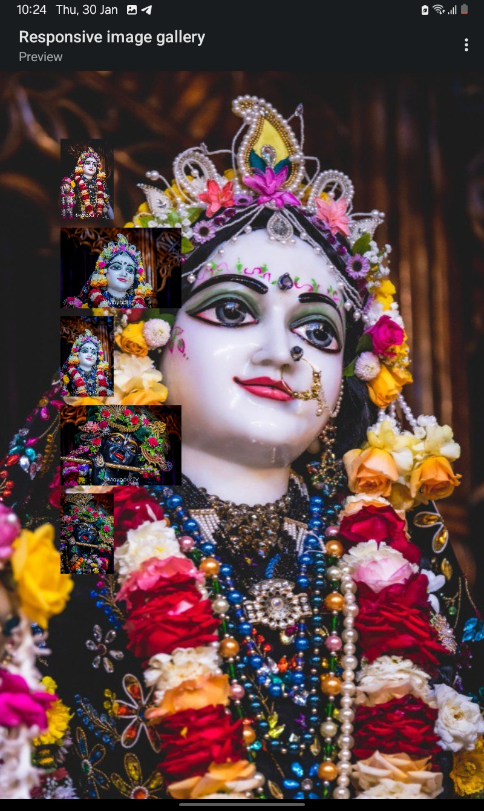

# Responsive Image Gallery

This project is a responsive image gallery that allows users to click on small images to display them in a larger view. The gallery is built using HTML, CSS, and JavaScript.

## Features

- Displays a gallery of small images
- Click on a small image to view it in a larger size
- Responsive design for various screen sizes

## How to Use

1. Open the `index.html` file in your web browser.
2. Click on any of the small images to view it in the larger image container.

## Files

- `index.html`: The main HTML file that contains the structure of the gallery.
- `style.css`: The CSS file for styling the gallery.
- `script.js`: The JavaScript file containing the functionality to display the larger image.

## HTML Code

```html
<!DOCTYPE html>
<html>

<head>
  <meta charset="UTF-8">
  <meta name="viewport" content="width=device-width, initial-scale=1">
  <link rel="stylesheet" href="style.css">
  <title>Responsive Image Gallery</title>
</head>

<body>
  <div class="product">
    <div class="product-small-img">
      
      
      
      
      
    </div>
  </div>
  
  <div class="image-container">
    
  </div>
  
  <script src="script.js"></script>
</body>

</html>
```

## CSS Code (style.css)

```css
body {
  font-family: Arial, sans-serif;
}

.product {
  display: flex;
  flex-wrap: wrap;
  justify-content: center;
}

.product-small-img img {
  width: 100px;
  margin: 5px;
  cursor: pointer;
  transition: transform 0.3s ease;
}

.product-small-img img:hover {
  transform: scale(1.1);
}

.image-container {
  text-align: center;
  margin-top: 20px;
}

#image-box {
  width: 300px;
}
```

## JavaScript Code (script.js)

```javascript
function myfunction(smallImg) {
  var fullImg = document.getElementById("image-box");
  fullImg.src = smallImg.src;
}
```

## Getting Started

1. Download the project files.
2. Open `index.html` in a web browser to see the image gallery in action.

## Screenshot


## Contributing

Feel free to contribute to this project by submitting issues or pull requests. Your contributions are always welcome!

## License

This project is licensed under the MIT License.

```
